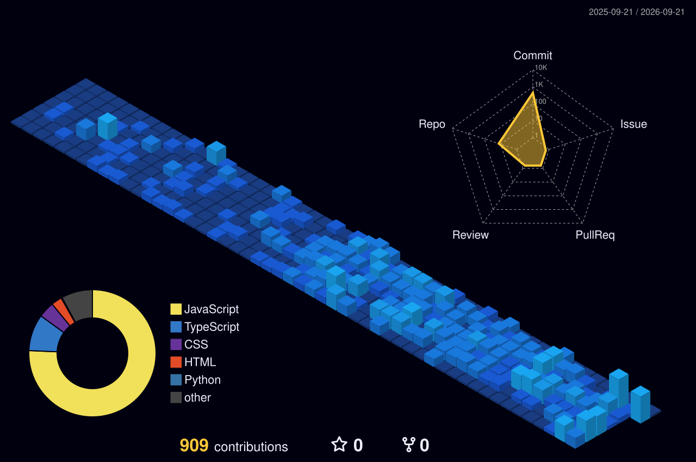

# 👋 Hi, I'm Khant Pyae Htoo!

I'm a passionate **Full Stack Developer** eager to build and learn new things every day. My main focus is on creating responsive and user-friendly web applications, and I'm constantly expanding my toolkit.

## 🚀 Technologies & Tools

- ### 💻 Languages & Core Frameworks
  
- ### 🧩 Styling & State Management
  
- ### 📦 Build Tools, Backend & Databases
  

---
## 🤝 Let's Connect

 
 

## 🌱 Learning Journey

I am continuously refining my craft—experimenting with advanced UI architecture, state management, and developer tooling. Focused on writing maintainable, production-ready code while contributing actively to open-source projects.

> “The expert in anything was once a beginner.” — Helen Hayes  
> "Do the best you can until you know better. Then when you know better, do better." – Maya Angelou

<b>Feel free to check out my repositories and connect with me!</b>

## 📈 Activity & Metrics

<!-- 3D Contribution Graph -->

  

   

<!-- GitHub Stats & Streak Cards -->
<!-- 

  
  

 -->

---

